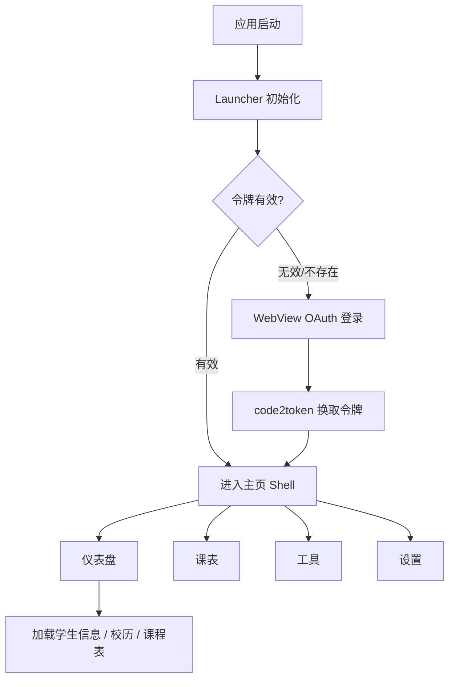

::: note 摘要

OneTJ（一统同济）是一个简洁、专注的同济大学服务第三方客户端，提供学生信息查询、课程表展示、校历浏览等功能。

::: right

2025-01-29 @OneTJ

:::

## 项目概述

**OneTJ** 是一个基于 Flutter 框架开发的跨平台移动应用，专为同济大学学生打造。它提供了简洁、专注的使用体验，支持查询学生信息、课程表、校历等数据，并支持离线访问。

### 项目特点

- **跨平台支持**：支持 Android、iOS、Web、Windows、macOS、Linux、OpenHarmony（鸿蒙）七大平台
- **离线友好**：使用 Hive 本地缓存，支持离线查看已缓存的数据
- **简洁专注**：界面简洁，专注于核心功能，无冗余内容
- **官方认证**：使用同济大学官方 Keycloak OAuth2 认证系统

## 主要功能

### 首页仪表盘

- 学期概览：当前学期名称、当前教学周
- 学籍信息：学院名称等基本信息
- 即将上课：按本周 / 今日 / 未来 N 节展示接下来的课程
- 功能宫格：快捷入口

### 课程表

- 展示学期课程表
- 显示课程名称、上课时间、教室、授课教师
- 支持按周次查看课程
- 自动索引和排序
- 支持自定义节次时间

### 成绩与考试

- 本科生成绩查询（支持按学期筛选）
- CET 四六级成绩
- 考试安排（后端 Scope 尚未开通，入口暂不可用）

### 校历

- 显示当前学期校历
- 展示当前周数
- 显示学期时间范围
- 显示学期总周数

### 工具

- 物理实验工具：迈克尔逊干涉仪、光栅衍射、夫兰克-赫兹实验
- 支持实验草稿保存

### 设置与应用更新

- 主题（亮/暗/跟随系统，自定义主辅色）、主页布局、节次时间、启动壁纸
- 数据收集授权、开发者选项、日志查看
- 应用内版本检查与更新

## 技术栈

| 技术 | 说明 |
|------|------|
| **框架** | Flutter（`ohos_flutter_3.35.7`，Dart SDK `^3.6.2`） |
| **语言** | Dart |
| **架构** | 分层 MVVM + Application Service |
| **依赖注入** | get_it |
| **本地存储** | Hive + shared_preferences |
| **网络请求** | HTTP |
| **认证** | OAuth2（同济大学 Keycloak） |
| **WebView** | flutter_inappwebview（本地 OpenHarmony fork） |
| **路由** | go_router |
| **状态管理** | ChangeNotifier + Stream\<UiEvent\> |
| **国际化** | flutter_localizations + ARB |
| **代码生成** | json_serializable + build_runner |

## 应用流程

## 项目状态

::: warning 注意事项

- 项目目前处于活跃开发阶段，部分功能可能不稳定
- 当前版本为 `2.5.0`（build `18`），已有 Windows 等平台发布产物
- 欢迎提交 Issue 和 Pull Request

:::

## 相关链接

- **GitHub 仓库**：[oierxjn/OneTJ](https://github.com/oierxjn/OneTJ)
- **原始仓库**：[FlowerBlackG/OneTJ](https://github.com/FlowerBlackG/OneTJ)
- **同济大学 API**：api.tongji.edu.cn
