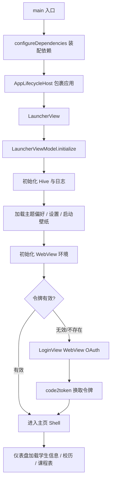

## 应用启动流程

OneTJ 的启动流程采用 **Launcher → Login / Home** 的设计模式。

### 流程图



## Launcher 模块

### 职责

- 初始化日志子系统与 Hive 本地存储
- 加载主题偏好、设置与启动壁纸
- 初始化 WebView 环境
- 检查令牌有效性，决定跳转到主页还是登录页
- 保证最短 1200ms 启动展示时间

### 核心流程

```dart
class LauncherViewModel extends BaseViewModel<UiEvent> {
  Future<void> initialize() async {
    AppLoggingBootstrap.ensureInitialized();

    final String route = await _initialize();
    await Future.delayed(const Duration(milliseconds: 1200));

    emit(NavigateEvent(route));
  }

  Future<String> _initialize() async {
    await _hiveStorageService.initializeHive();
    await appLocator<ThemeChangeNotifier>().initialize();

    final settings = await appLocator<SettingsRepository>().getSettings(
      refreshFromStorage: true,
    );
    // 解析启动壁纸
    await WebViewEnvironmentService.instance.initialize();
    return _resolveInitialRoute();
  }

  Future<String> _resolveInitialRoute() async {
    final token = await appLocator<TokenRepository>()
        .getToken(refreshFromStorage: true);
    if (token == null) return RoutePaths.login;

    try {
      await appLocator<AuthTokenProvider>().getValidAccessToken();
      return RoutePaths.home;
    } catch (_) {
      return RoutePaths.login;
    }
  }
}
```

## Login 模块

### 职责

- 展示 WebView 进行 OAuth2 认证
- 捕获重定向 URL 中的授权码
- 校验 `state` 与 `error`，交换授权码获取令牌
- 保存令牌到本地

### OAuth2 流程

```
用户              LoginView              同济 Keycloak
 │                    │                        │
 │  打开登录页         │                        │
 │───────────────────>│                        │
 │                    │  buildAuthUri（含 state、kc_idp_hint）│
 │                    │───────────────────────>│
 │                    │  返回授权页面           │
 │  输入凭据           │<───────────────────────│
 │───────────────────>│                        │
 │                    │  重定向到 redirect_uri  │
 │                    │<───────────────────────│
 │  exchangeCodeIfRedirect 校验 state/code     │
 │                    │  code2token 交换        │
 │                    │───────────────────────>│
 │                    │  返回令牌               │
 │  跳转到主页         │                        │
 │<───────────────────│                        │
```

### 授权 URI 构建

```dart
Uri buildAuthUri() {
  return Uri.https(_baseUrl, _path, {
    'response_type': 'code',
    'client_id': _clientId,
    'redirect_uri': _redirectUri,
    'scope': _scope,
    'state': _state,          // UUID v4，防 CSRF
    'kc_idp_hint': 'tjiam',
  });
}
```

### WebView 处理

```dart
Future<bool> exchangeCodeIfRedirect(WebUri uri) async {
  if (!uri.toString().startsWith(_redirectUri)) return false;

  // 授权服务器错误重定向（如 invalid_scope）
  final error = uri.queryParameters['error'];
  if (error != null && error.isNotEmpty) {
    throw AuthRedirectException(
      error: error,
      errorDescription: uri.queryParameters['error_description'],
    );
  }

  final code = uri.queryParameters['code'] ?? '';
  if (code.isEmpty) throw AuthRedirectException(error: 'missing_code');

  // state 不匹配视为潜在网络攻击
  final state = uri.queryParameters['state'] ?? '';
  if (state != _state) throw AuthStateMismatchException();

  await _auth.exchangeCode(code);
  return true;
}
```

## Home 模块

### 职责

- 通过 `StatefulShellRoute.indexedStack` 承载主页四个标签页
- 各标签页按需加载数据

### 一级页面

| 页面 | 路径 | 功能 |
|------|------|------|
| **仪表盘** | `/home/dashboard` | 学生信息、校历、即将上课、功能宫格 |
| **课程表** | `/home/timetable` | 按周次展示课程表 |
| **工具** | `/home/tools` | 物理实验、成绩、考试、四六级入口 |
| **设置** | `/home/settings` | 主题、布局、节次、开发者选项等 |

### Shell 外详情页

| 页面 | 路径 |
|------|------|
| **成绩** | `/home/grades` |
| **四六级成绩** | `/home/cet-score` |
| **考试安排** | `/home/student-exams` |
| **物理实验** | `/home/tools/physics-lab` 及其子路由 |
| **设置二级页** | `/home/settings/about`、`/home/settings/time-slots` 等 |

## 数据加载流程

以仪表盘为例，`DashboardViewModel.load()` 并行加载：

```dart
Future<void> load() async {
  _studentLoading = true;
  _calendarLoading = true;
  _timetableLoading = true;
  notifyListeners();

  unawaited(_checkUpdateInBackground());
  try {
    await Future.wait([
      loadSettings(),
      loadStudentInfo(),
      loadSchoolCalendar(),
      loadCourseSchedule(),
      _uploadUserCollectionWhenStudentInfoLoaded(),
    ]);
  } finally {
    _scheduleUpcomingRefresh();
  }
}
```

数据获取通过 Application Service 协调 Repository 缓存与 API：

```dart
Future<SchoolCalendarData> getSchoolCalendar() async {
  final repo = appLocator<SchoolCalendarRepository>();
  await repo.warmUp(); // 先加载本地缓存
  return repo.getOrFetch(
    now: DateTime.now(),
    fetcher: _api.fetchSchoolCalendarCurrentTerm,
  );
}
```

## 令牌管理

### 令牌类型

| 令牌 | 用途 | 有效期 |
|------|------|--------|
| **Access Token** | 调用 API | 短期（约 1 小时） |
| **Refresh Token** | 刷新 Access Token | 长期（约 30 天） |

### 数据结构

`TokenData` 存储于 Hive（box `auth_token`），记录 `issuedAt` 与有效期，提供过期判断：

```dart
bool isAccessTokenExpired({Duration skew = Duration.zero}) {
  final expiresAt = issuedAt.add(Duration(seconds: accessTokenExpiresIn));
  return DateTime.now().add(skew).isAfter(expiresAt);
}
```

### 自动刷新

由 `AuthTokenProvider.getValidAccessToken()` 统一处理：

```dart
Future<String> getValidAccessToken() async {
  final token = await _repository.getToken(refreshFromStorage: true);
  if (token == null) throw AppException('AUTH_REQUIRED', 'Missing access token');

  if (!token.isAccessTokenExpired(skew: _tokenSkew)) {
    return token.accessToken;
  }
  if (token.isRefreshTokenExpired(skew: _tokenSkew)) {
    throw AppException('AUTH_EXPIRED', 'Refresh token expired');
  }

  final refreshed = await _refreshToken(token.refreshToken);
  await _repository.saveFromCode2Token(refreshed);
  return refreshed.accessToken;
}
```

其中 `_tokenSkew` 为 30 秒的时钟偏移缓冲。

## 应用更新流程

1. 应用启动时 `AppLifecycleHost` 监听生命周期
2. 仪表盘加载时后台检查更新（`AppUpdateService.checkForUpdate(force: false)`）
3. 有更新时发出 `AppUpdateAvailableEvent`，由 `AppUpdateFlowCoordinator` 展示更新弹窗
4. 支持跳过版本、下载安装、迁移；应用恢复前台时尝试恢复待安装更新

## 错误处理

### 异常体系

`lib/app/exception/app_exception.dart` 定义了统一的异常体系：

| 异常 | 错误码 | 说明 |
|------|--------|------|
| `AppException` | 自定义 | 基类，构造时记录日志 |
| `AuthStateMismatchException` | `AUTH_STATE_MISMATCH` | OAuth state 不匹配 |
| `AuthRedirectException` | `AUTH_REDIRECT_ERROR` | 授权服务器错误重定向 / 缺少 code |
| `NetworkException` | `NETWORK_ERROR` | 网络请求失败（含 statusCode / uri / body） |
| `JSONResolveException` | `JSON_RESOLVE_ERROR` | JSON 解析失败 |
| `SettingsValidationException` | `SETTINGS_VALIDATION_ERROR` | 设置校验失败 |
| `RepositoryClearingException` | `REPOSITORY_CLEARING` | 仓库清理期间访问 |

### 错误流程

```
API 调用
    ↓
失败 → 抛出 AppException 子类（并记录日志）
    ↓
ViewModel 捕获
    ↓
emit(ShowSnackBarEvent / AppUpdateFailedEvent ...)
    ↓
View 订阅事件流
    ↓
显示 SnackBar / 弹窗提示
```